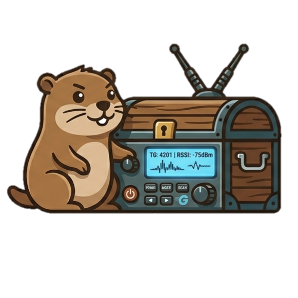

<p align="center">
  
</p>

<h1 align="center">GopherTrunk</h1>

<p align="center">
  <strong>Pure-Go digital-trunking radio scanner engine for RTL-SDR · HackRF · Airspy · Airspy HF+.</strong><br>
  P25 · DMR · TETRA · NXDN · Motorola Type II · EDACS · LTR · MPT 1327 · dPMR · D-STAR · YSF.<br>
  Zero CGO, single static binary, headless daemon + Bubbletea TUI cockpit + browser web console.
</p>

<p align="center">
  <a href="https://github.com/MattCheramie/GopherTrunk/actions/workflows/ci.yml"></a>
  <a href="https://github.com/MattCheramie/GopherTrunk/releases"></a>
  <a href="LICENSE"></a>
  <a href="go.mod"></a>
  <a href="https://goreportcard.com/report/github.com/MattCheramie/GopherTrunk"></a>
  <a href="https://gophertrunk.org"></a>
</p>

---

## What is this?

GopherTrunk is a software-defined-radio scanner that follows digital
trunked-radio voice calls and decodes them to audio. It runs on a
pool of RTL-SDR (every osmocom tuner), HackRF (One / Jawbreaker /
Rad1o), Airspy R2 / Mini, and Airspy HF+ dongles, has no C
dependencies at build or runtime (no `librtlsdr` / `libhackrf` /
`libairspy` / `libairspyhf` / `libusb` / `libasound2` /
`libmp3lame`), and ships as a single ~10 MB static binary for Linux,
macOS, and Windows.

Completed calls stream to Broadcastify Calls, RdioScanner, OpenMHz,
and live Icecast / ShoutCast mountpoints out of the box. Why does
this exist? Read **[The Story of GopherTrunk](https://gophertrunk.org/story.html)**.

## Quick start

```sh
# Linux x86_64 — see https://gophertrunk.org/downloads.html for macOS, Windows, ARM64.
VERSION=v0.2.2
curl -L -o gophertrunk.tar.gz \
  https://github.com/MattCheramie/GopherTrunk/releases/download/${VERSION}/gophertrunk-${VERSION}-linux-amd64.tar.gz
tar xzf gophertrunk.tar.gz && cd gophertrunk-${VERSION}-linux-amd64
cp config.example.yaml config.yaml
./gophertrunk version
# Plain `./gophertrunk` (no subcommand, on a TTY) drops into the
# interactive launcher: pick [1] TUI, [2] Web, or [3] Headless.
# Skip the prompt with -tui / -web / -headless.
./gophertrunk -config config.yaml
```

Windows users get a one-click installer that bundles Zadig for
WinUSB driver setup; macOS users get notarised tarballs for Apple
Silicon and Intel. Full per-OS recipes at
**[gophertrunk.org/downloads.html](https://gophertrunk.org/downloads.html)**.

## Features

- **Trunked control-channel decoders** — P25 Phase 1 + Phase 2 (full
  TIA-102 chain), DMR Tier II + Tier III (vendor-aware: Capacity
  Plus / Capacity Max grants and rest-channel tracking), NXDN,
  Motorola Type II / SmartZone, EDACS / GE-Marc, LTR, MPT 1327,
  dPMR Mode 3, TETRA TMO. Amateur-radio: D-STAR and Yaesu System
  Fusion.
- **Pure-Go voice path** — IMBE (P25 Phase 1) and AMBE+2 (P25
  Phase 2 / DMR) vocoders in Go, no DVSI / mbelib dependency.
  Per-call WAV + raw-frame sidecars; live PCM playback via direct
  ALSA / WASAPI / CoreAudio.
- **Pure-Go SDR drivers** — RTL-SDR, HackRF, Airspy R2 / Mini,
  Airspy HF+ family. USB transport on Linux (USBDEVFS), Windows
  (WinUSB), macOS (IOKit). USB-disconnect self-healing recovers
  dongles that drop off the bus and re-enumerate without
  restarting the daemon. See
  [docs/hardware.md](docs/hardware.md).
- **One dongle, many repeaters** — `role: wideband` pins a single
  SDR to a centre frequency and runs an internal channelizer so
  one dongle decodes every DMR Tier II conventional repeater AND
  a DMR Tier III control channel that fit inside its IQ bandwidth
  (e.g. several 12.5 kHz carriers inside a 2.4 MHz IQ window).
  Mix T2 and T3 channels on the same dongle. See
  [docs/hardware.md](docs/hardware.md) and
  [samples/dmr-tier2-multichannel/](samples/dmr-tier2-multichannel/).
- **DSP** — Polyphase channelizer, Kaiser / RRC / Gaussian FIRs,
  FM / C4FM / GFSK / FFSK / DQPSK / π/4-DQPSK / π/8-H-DQPSK
  demods, Mueller-Müller + Gardner clock recovery, LMS + CMA
  equalizers, diversity combining.
- **APIs** — gRPC + HTTP/SSE + WebSocket; optional TLS +
  bearer-token auth on mutations; Prometheus `/metrics`; pure-Go
  SQLite call log; in-process pub/sub event bus.
- **Outbound call streaming** — Broadcastify Calls, RdioScanner,
  OpenMHz, live Icecast / ShoutCast with pre-encoded silence keep-alive.
  Pure-Go MP3 encoder. See `internal/broadcast`.
- **Baseband recording + offline replay** — Two-channel 16-bit WAV
  capture and a replay driver that mounts captures back into the
  SDR pool as virtual tuners. Looping replay simulates a
  continuous source.
- **Operator surfaces** — Bubbletea TUI cockpit with 12 panels,
  pure-browser React SPA web console, runtime config editing via
  `PATCH /api/v1/settings`, RadioReference PDF / CSV importer with
  a config-builder wizard.
- **Location + affiliation** — NMEA-0183 GGA / RMC over the air
  decoded into a SQLite `location_log`; protocol-agnostic
  affiliation tracker fed from grants / registrations / affiliation
  events.

For the full per-protocol FEC chain reference, receiver internals,
frame layouts, and API routes, see
[docs/architecture.md](docs/architecture.md) and
[docs/opt-in-features.md](docs/opt-in-features.md).

## Status snapshot

Once a `grant` event lands on the bus, the engine + recorder pipeline
runs end-to-end: voice device is allocated, the composer pulls IQ →
PCM, the recorder writes a WAV, the call is logged to SQLite, and
the API + TUI surfaces all light up. Every trunked control
modulation in the Features list has an end-to-end IQ → CC chain
shipping. SDRtrunk-parity subsystems (outbound streaming, baseband
recording, GPS / location, affiliation tracking, decoded-message
log, per-talkgroup policy) all ship.

**Remaining gaps:**

- **Digital-voice composer chains.** FM, DMR, P25 Phase 1 / 2 decode
  to audio. NXDN, dPMR, TETRA, YSF, D-STAR voice (plus EDACS
  ProVoice) are followed and logged but not yet turned into PCM.
- **Additional SDR validation.** HackRF / Airspy / HF+ drivers
  exercise the documented USB vendor protocols under unit tests
  against a mock transport; on-air validation against attached
  hardware is the documented follow-up.
- **FEC inner-layer real-air validation.** NXDN per-protocol
  interleaver and TETRA on-air recovery margins need live captures
  to characterise.
- **Vocoder level calibration** awaits reference WAVs in
  `internal/voice/{imbe,ambe2}/testdata/`.

The long-form status, per-protocol detail, and shipping-vs-pending
checklist live in **[docs/status.md](docs/status.md)**. Near-term
plans live in **[docs/roadmap.md](docs/roadmap.md)**. Released work
lives in **[CHANGELOG.md](CHANGELOG.md)**.

## Build from source

```sh
make dist     # SPA + daemon — single binary that serves the web console at /
make build    # Go-only — fast iteration; daemon shows a helpful 404 at / until bundled
make test     # go test -race ./...
make vet      # go vet ./...
make integration  # daemon end-to-end test (no SDR required)
```

The per-protocol "lights up" integration tests
(`make integration-cc-<proto>`) and the DVSI hardware-backend tests
(`make test-dvsi`) are documented in
[`CONTRIBUTING.md`](CONTRIBUTING.md).

A bare `go build ./cmd/gophertrunk` works too — the binary
auto-stamps its version line from Go's built-in VCS info. Useful
when attaching a log to an issue and you want the commit hash in
the build-info line.

### Docker

```sh
docker compose up -d
curl -s http://localhost:8080/api/v1/health
curl -s http://localhost:8080/metrics | grep gophertrunk_build_info
```

USB pass-through recipe and the operator hardening playbook (TLS,
bearer-token auth, Prometheus catalogue, smoke tests) live in
[docs/hardening.md](docs/hardening.md).

## Documentation

Operator-facing docs live at **[gophertrunk.org](https://gophertrunk.org)**
(rendered from this `docs/` tree):

- **Install** — [Downloads](https://gophertrunk.org/downloads.html) ·
  [Hardware](docs/hardware.md) ·
  [Linux](docs/install-linux.md) ·
  [macOS](docs/install-macos.md) ·
  [Windows](docs/install-windows.md)
- **Operate** — [Launcher](docs/launcher.md) ·
  [Windows user guide](docs/user-guide-windows.md) ·
  [TUI](docs/tui.md) ·
  [Web console](docs/web.md) ·
  [Live config editing](docs/live-edits.md) ·
  [Import (PDF / CSV)](docs/import.md) ·
  [Hardening](docs/hardening.md)
- **Reference** — [Architecture](docs/architecture.md) ·
  [Vocoders](docs/vocoders.md) ·
  [Voice calibration](docs/voice-calibration.md) ·
  [DMR encryption](docs/dmr-encryption.md) ·
  [Opt-in features](docs/opt-in-features.md) ·
  [Status](docs/status.md) ·
  [Roadmap](docs/roadmap.md) ·
  [Cutting a release](docs/release.md)
- **Project metadata** — [CHANGELOG](CHANGELOG.md) ·
  [CONTRIBUTING](CONTRIBUTING.md) ·
  [SECURITY](SECURITY.md) ·
  [THIRD_PARTY_LICENSES](THIRD_PARTY_LICENSES.md)

## Support the project

GopherTrunk is developed in the open and powered entirely by
community support. If it's useful to you, please consider chipping
in:

- [Sponsor on GitHub](https://github.com/sponsors/MattCheramie)
- [Tip on Ko-fi](https://buymeacoffee.com/Mrcheramie)

More ways to help: [docs/support.md](docs/support.md).

## License

See [LICENSE](LICENSE).
